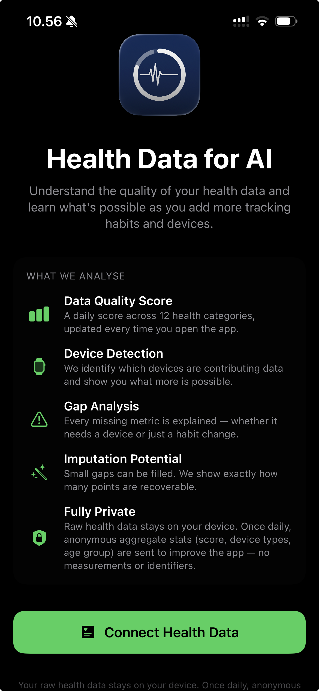

# Georgi Petkov

Data & AI engineer — I build real, running systems: cloud data pipelines and AI-native mobile apps, not just notebooks.

## Featured Projects

### [healthkit-medallion-pipeline](https://github.com/Georgi-Petkov/healthkit-medallion-pipeline)

End-to-end Bronze/Silver/Gold data pipeline for Apple HealthKit exports — built as a real, running system and verified end-to-end against production data.

- **Ingest** — Azure Function (Python), managed-identity auth to storage, idempotent writes to Bronze
- **Bronze → Silver** — Databricks Lakeflow Declarative Pipeline, deduped via Auto CDC (Unity Catalog)
- **Silver → Gold** — dbt marts: daily activity summary, weekly trends, metric freshness
- **CI/CD** — GitHub OIDC federation to Azure; zero secrets stored in GitHub, ever

### Health Data for AI (MyHealthData) — iOS app, in TestFlight

Scores the quality of your Apple Health data across 12 categories and shows exactly what's missing, why, and how to fix it — built around a simple idea: "good enough to glance at" and "good enough to actually train or coach an AI on" are different bars.

- **Data Quality Score (0–100)** across Body Composition, Heart & Circulation, Activity, Sleep, Mobility, Nutrition, and more
- **Three-horizon scoring** (14d / 90d / 180d, weighted toward the 180-day "AI-ready" window) — rewards consistent long-term tracking over a good recent week
- **Gap analysis** — classifies every missing metric as *structural* (needs a device) or *temporal* (needs a habit change), plus imputation potential for recoverable points
- **Privacy-first** — raw health data never leaves the device; only anonymous daily aggregate stats are shared, with explicit opt-in consent

---

## Earlier projects

Older data science exercises and scripts (Kaggle exploration, movie dataset analysis, ETL scripts, etc.) below.
